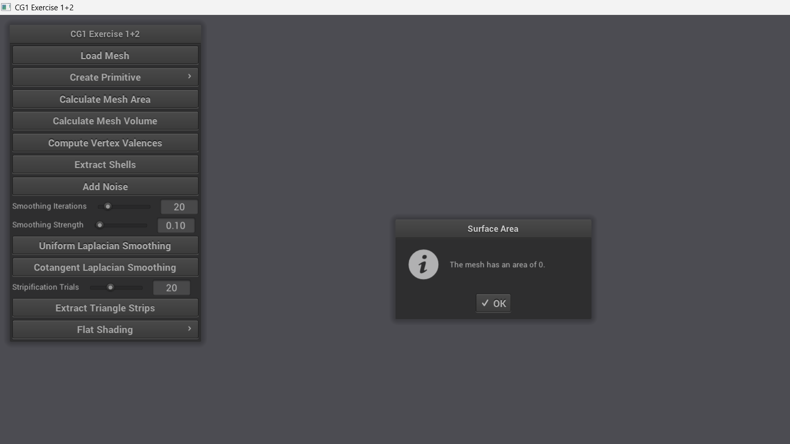
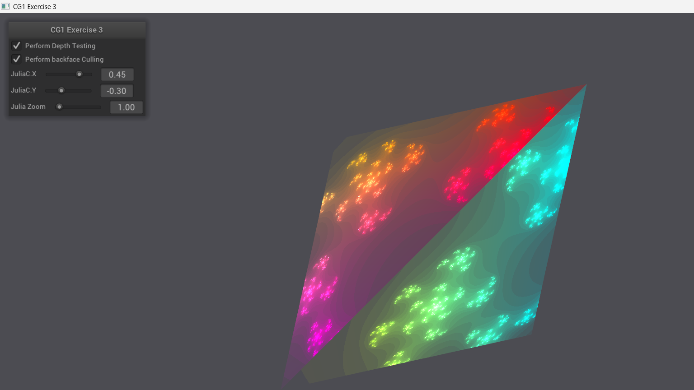
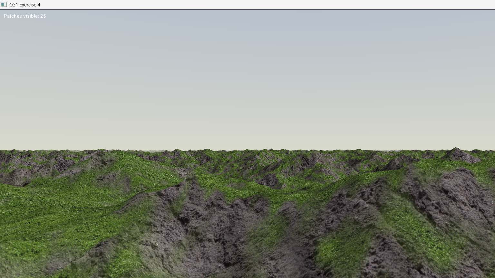
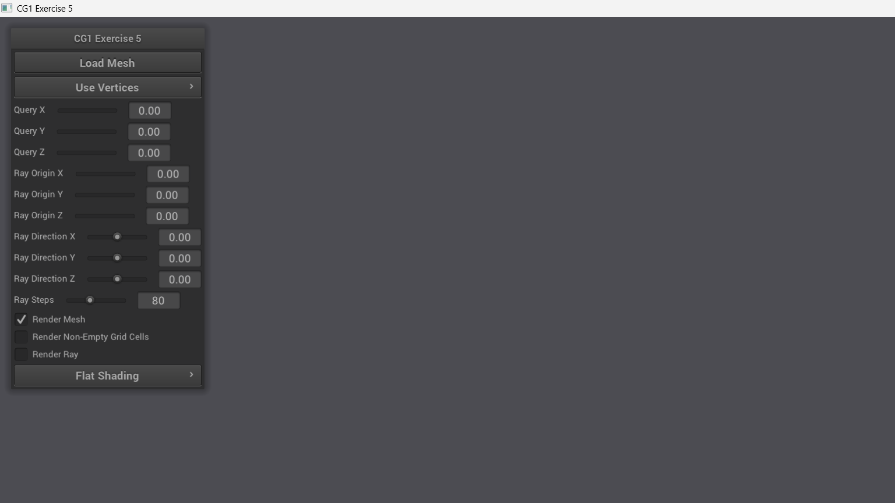

# OpenGL Computer Graphics


A series of four interactive C++/OpenGL applications developed for the Computer Graphics 1 course at TU Dresden, covering core rendering and geometry topics: half-edge mesh processing, procedural texturing via GLSL fragment shaders, GPU terrain rendering with multi-texture blending, and spatial collision detection using AABB trees and hash grids.

## Screenshots

- **Mesh Processing (Exercises 1 & 2)** — interactive viewer for loading OBJ meshes and geometric primitives, with controls for Laplacian smoothing, surface area, volume, valence computation, and triangle strip extraction.

  

- **Procedural Julia Fractal (Exercise 3)** — real-time Julia set rendered on a 3D quad via a GLSL fragment shader, with interactive Julia C and zoom parameters controllable at runtime.

  

- **Terrain Rendering (Exercise 4)** — GPU-rendered terrain with multi-texture blending (grass, rock), normal-mapped road overlay, and a procedural sky, all driven from a height map.

  

- **Collision Detection (Exercise 5)** — spatial indexing with AABB tree and uniform hash grid for efficient ray-mesh intersection and nearest-neighbour queries, with configurable ray and query parameters.

  

## Features

- **Half-Edge Mesh Operations** — load OBJ meshes and compute surface area, volume, and vertex valences using OpenMesh's half-edge data structure
- **Geometric Primitives** — procedural generation of quads, disks, spheres, cubes, cylinders, tori, icosahedra, tetrahedra, and arrows
- **Laplacian Mesh Smoothing** — uniform and cotangent-weight Laplacian smoothing with configurable iterations and strength
- **Triangle Stripification** — greedy triangle strip extraction for optimised GPU memory usage
- **Shell Extraction** — identification and isolation of connected mesh components
- **GLSL Procedural Texturing** — Julia set fractal rendered as a fragment shader with real-time parameter tweaking
- **Terrain Rendering** — height-map terrain with multi-texture blending, normal mapping, and sky dome rendering
- **Spatial Indexing** — AABB tree and hash grid structures for efficient nearest-neighbour and ray intersection queries
- **Interactive Viewer** — NanoGUI-based control panels across all exercises with mouse-orbit camera

## Tech Stack

| Layer | Technology | Purpose |
|-------|-----------|---------|
| Language | C++17 | Core algorithm implementations |
| Graphics API | OpenGL 4.x | GPU rendering pipeline |
| Shader Language | GLSL | Procedural texturing, terrain, sky |
| Mesh Library | OpenMesh | Half-edge mesh structure and I/O |
| Math | Eigen | Linear algebra and matrix operations |
| GUI | NanoGUI | Interactive control panels |
| Windowing | GLFW | Window creation and input handling |
| Build System | CMake | Cross-platform project configuration |

## Project Structure

```
computer-graphics/
├── common/              # Shared base classes: camera, shader pool, GL wrappers
├── data/                # Sample 3D models (.obj) — bunny, dragon, cow, horse, venus…
├── exercise1_2/         # Mesh processing: primitives, smoothing, area, volume
│   ├── include/         # Valence, Smoothing, Stripification, ShellExtraction headers
│   └── src/             # Viewer and algorithm implementations
├── exercise3/           # Julia fractal procedural texturing
│   ├── glsl/            # shader.frag / shader.vert
│   └── src/             # Viewer
├── exercise4/           # Terrain rendering
│   ├── glsl/            # terrain.frag/vert, sky.frag/vert
│   └── resources/       # Grass, rock, road textures + normal maps
├── exercise5/           # Collision detection and spatial indexing
│   ├── include/         # AABBTree, HashGrid, GridTraverser headers
│   └── src/             # Ray-triangle intersection implementations
└── ext/                 # External dependencies (NanoGUI, OpenMesh — git submodules)
```

## Getting Started

### Prerequisites

- CMake 3.x or newer
- C++17-capable compiler (GCC 8+, MSVC 2019+, or Clang 7+)
- OpenGL 4.x capable GPU and drivers

### Build on Linux / macOS

```bash
git clone --recursive https://github.com/lourencosilvabeato/computer-graphics.git
cd computer-graphics
mkdir build && cd build
cmake ..
make
# Compiled binaries appear in build/bin/
```

**Missing dependencies on Debian/Ubuntu:**
```bash
sudo apt install git make cmake libxxf86vm1 libxrandr2 libxinerama1 libxcursor1 \
  libx11-6 libc6 libstdc++6 libgcc-8-dev libxext6 libxrender1 libxfixes3 \
  libxcb1 libxau6 libxdmcp6 libbsd0
```

### Build on Windows (Visual Studio)

1. Clone the repository with `--recursive`
2. Open **CMake GUI** → set *Where is the source code* to the cloned directory, *Where to build the binaries* to a new `build/` subfolder
3. Click **Configure**, select your Visual Studio version, then **Generate** and **Open Project**
4. In Visual Studio, set the desired startup project (`Exercise1_2`, `Exercise3`, `Exercise4`, or `Exercise5`) and build
